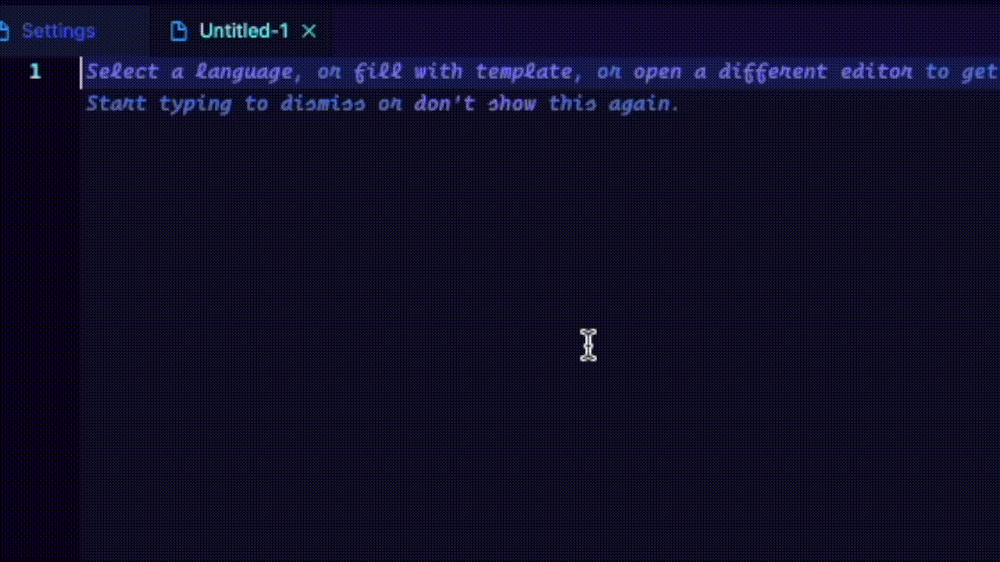

# Font Randomizer

Do you like more than one font? Well, now you don't have to choose just one! With font randomizer, you can have Visual Studio Code select one of your favorite fonts for you.

Getting tired of the current font? With one command, you can change it to another one of your favorites!

## Features

This extension randomly selects a font from a list defined in its settings. You can freely add, edit, and delete fonts from this list by going into settings (Mac: command + , Windows: ctrl + ,) and searching for "random font list." If there are no valid fonts in the list, it will select the default monospace font. Additionally, the font can be randomized by clicking the refresh icon in the status bar.

The current font will be displayed in the status bar as well, just in case you're ever wondering which one it gave you today! Clicking on the font name in the status bar will allow you to select the font manually, or jump to the settings page to manage your font list.

## Extension Settings

This extension contributes the following settings:

- `fontRandomizer.fontList`: The array of fonts that the extension selects from.
- `fontRandomizer.activateOnStartup`: This determines if the extension changes the font every time you start up vs code or not (default: true)

## Support the dev

Like this extension? Consider leaving a review (it's free) or, if you _really_ like it, tip me a few bucks on ko-fi.

<a href='https://ko-fi.com/supportkofi' target='_blank'>
